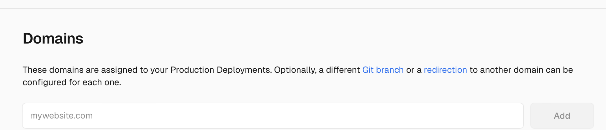
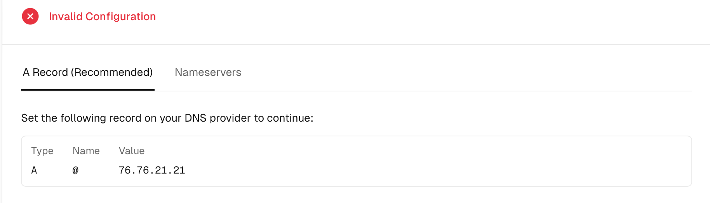
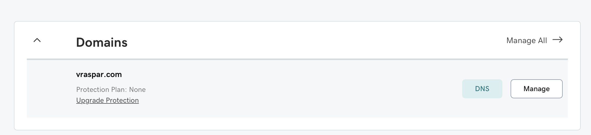

[Vercel](https://vercel.com) is really a great platform for deploying static sites and deplyoing your app is really straightforward. But when it comes to adding a custom domain to your Vercel app, it can be a bit tricky. In this post, I'll show you how to add a Godaddy domain to your Vercel app. 

I'll assume you already have a Vercel project and a Godaddy domain. If you don't have a Vercel project, you can create one by following the [official guide](https://vercel.com/docs). If you don't have a Godaddy domain, you can purchase one from the [Godaddy website](https://www.godaddy.com/).

1. First, go to your Vercel dashboard and select the project you want to add a custom domain to.
2. Click on the "Settings" tab in the top right corner. Scroll down to the "Domains" section.

3. Now type your domain name in the input field and click "Add".
4. After you have added your domain, you will see a message saying Invalid configuration, and DNS record that you need to add to Godaddy.

5. Now go to your Godaddy account and log in. Click on your profile icon in the top right corner and select "My Products". The screen will show all your products/domains. Click on the "DNS" button next to the domain you want to connect to your Vercel app.

6. Now you will see the DNS management page. Click on "Add new Record" and add Type, Name, and Value from the Vercel Domains tab. The defualt value of the TTL should be fine, for most cases. Click "Save" to save the record. [Note: If you were previously hosting your domain through Godaddy, you may have to unpublish the website and delete the existing records to avoid conflicts.]

7. Go back to the Vercel Domains tab and click on "Refresh" to check if the DNS record has been added successfully. If everything is correct, you will see a message saying "Valid configuration".

That's it! Your custom domain should now be connected to your Vercel app. It may take some time for the changes to propagate, so be patient. Once the domain is connected, you can access your app using the custom domain name.